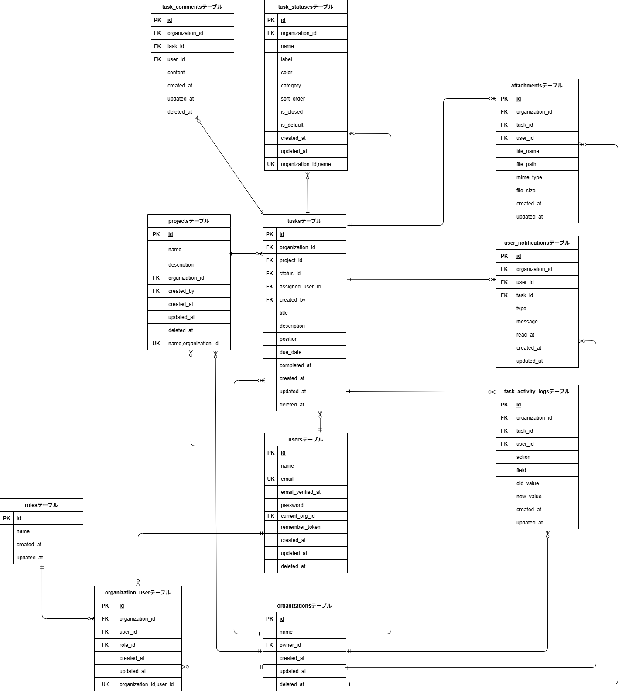

# TeamFlow Backend

Laravelで開発した業務管理SaaS「TeamFlow」のバックエンドAPIです。

プロジェクト・タスク管理を中心に、マルチテナント構成、認証・認可、コメント、添付ファイル、通知など、実際の業務アプリケーションを想定した機能を実装しています。

## 概要

TeamFlowは、Organization単位でプロジェクトやタスクを管理できる業務管理SaaSアプリケーションです。

Laravel SanctumによるSPA認証、Organization単位のデータ分離、Role・Policyによる権限制御などを実装し、単純なCRUDだけでなく、実務を想定したSaaSバックエンドの設計を意識しています。

FrontendはNext.jsで構築し、Backendとは別リポジトリで管理しています。

- Backend: `https://github.com/chiemi123/teamflow-backend`
- Frontend: `https://github.com/chiemi123/teamflow-frontend`

---

## 技術スタック

| Category            | Technology             |
| ------------------- | ---------------------- |
| Framework           | Laravel 12             |
| Language            | PHP 8.2+               |
| Development Runtime | Laravel Sail / PHP 8.5 |
| Authentication      | Laravel Sanctum 4      |
| Database            | MySQL 8.4              |
| Environment         | Docker / Laravel Sail  |
| Web Server          | Nginx                  |
| Testing             | PHPUnit 11             |
| API                 | REST API               |

Docker開発環境には、Redis、Meilisearch、Mailpit、Seleniumも含まれています。

---

## 主な機能

- Laravel SanctumによるSPA認証
- Project CRUD
- Task CRUD
- Task Status管理
- タスク担当者設定
- コメント投稿・編集・削除
- 添付ファイルのアップロード・ダウンロード・削除
- アプリ内通知・既読管理
- Organizationメンバー取得
- Role / Policyによる権限制御
- Organization単位のデータ分離
- Soft Delete
- Seederによるデモ環境構築

---

## マルチテナント

Organization単位でデータを分離するマルチテナント構成を採用しています。

UserとOrganizationの所属関係を `organization_user` で管理し、現在選択中のOrganizationを `current_org_id` で保持しています。

ProjectやTaskなどのOrganizationに属するデータには `organization_id` を持たせ、`TenantScope` を利用して現在のOrganizationを基準にデータを取得します。

これにより、異なるOrganizationのデータが通常のクエリで混在しないようにしています。

---

## ロールベースアクセス制御

Organization内では、以下の3つのRoleを使用しています。

| Role   | Description            |
| ------ | ---------------------- |
| Owner  | Organizationの所有者   |
| Admin  | 管理権限を持つユーザー |
| Member | 一般ユーザー           |

Laravel Policyを利用し、Organizationへの所属、Role、リソースとの関係をもとに認可を行っています。

ProjectではOwner / Adminを中心に作成・更新・削除を制御しています。

TaskやCommentについてもPolicyによる認可を行い、Commentの編集・削除は投稿者本人のみ可能としています。

また、API Resourceから操作権限をFrontendへ返すことで、Backendの認可とFrontendのUI制御を連携させています。

---

## データ構成

主な業務テーブルとリレーションは以下のとおりです。



### Main Tables

- `organizations`
- `users`
- `roles`
- `organization_user`
- `projects`
- `tasks`
- `task_statuses`
- `task_comments`
- `attachments`
- `user_notifications`
- `task_activity_logs`

---

## タスクステータス管理

Taskでは以下のステータスを管理しています。

- Todo
- In Progress
- Review
- Done

TaskをDoneへ変更した場合は `completed_at` に完了日時を記録します。

Doneから別のステータスへ戻した場合は `completed_at` を `null` に戻し、現在のTask Statusと完了状態の整合性を保つようにしています。

---

## 通知

TeamFlowではアプリ内通知を実装しています。

主に以下の操作に応じて通知を生成します。

- コメント追加
- タスク更新
- ステータス変更
- 添付ファイル追加

通知は既読状態を管理できます。

---

## API

主なAPIは以下のとおりです。

| Resource             | Main Operations                                          |
| -------------------- | -------------------------------------------------------- |
| Authentication       | Login / Logout / Current User                            |
| Projects             | List / Detail / Create / Update / Delete                 |
| Tasks                | List / Detail / Create / Update / Delete / Status Update |
| Task Statuses        | List                                                     |
| Comments             | List / Create / Update / Delete                          |
| Attachments          | List / Upload / Download / Delete                        |
| Notifications        | List / Mark as Read                                      |
| Organization Members | List                                                     |

---

## テスト

PHPUnitによるFeature Testを中心に、APIの正常系だけでなく、認証・認可やOrganization間のデータ分離も検証しています。

主なテスト対象：

- Authentication
- Project / Task
- Task Status
- Comment / Attachment
- Notification
- Authorization
- Organization separation
- Organization Members

TeamFlow v1完成時点：

```text
58 tests passed
188 assertions
```

---

## 開発環境

TeamFlowの開発には、以下の環境を使用しています。

- Windows 11
- WSL2 / Ubuntu
- Docker Desktop
- Laravel Sail
- Visual Studio Code

Backend / Frontendは別リポジトリで管理しています。

Docker環境はBackend側の `compose.yaml` で管理し、Frontendリポジトリを同じ親ディレクトリから参照する構成です。

```text
teamflow/
├── teamflow-backend/
└── teamflow-frontend/
```

### リバースプロキシ

Nginxをリバースプロキシとして使用し、FrontendとBackendを `laravel.test` の同一ホストで扱っています。

```text
Browser
   |
   | http://laravel.test
   v
 Nginx
   |
   +-- /          -> Next.js
   +-- /api/*     -> Laravel API
   +-- /sanctum/* -> Laravel Sanctum
```

通常の画面アクセス、Laravel API、Sanctumへのリクエストを同一ホスト経由で扱う構成にしています。

---

## セットアップ

### 必要環境

以下の環境・ツールが必要です。

- Docker
- Docker Compose
- Git

> 開発時はWindows 11 + WSL2 + Docker Desktop環境で動作確認しています。

### 1. クローン

任意の作業ディレクトリを作成し、Backend / Frontendを同じ親ディレクトリへcloneします。

```bash
mkdir teamflow
cd teamflow

git clone https://github.com/chiemi123/teamflow-backend.git
git clone https://github.com/chiemi123/teamflow-frontend.git
```

以下のディレクトリ構成になります。

```text
teamflow/
├── teamflow-backend/
└── teamflow-frontend/
```

Backendディレクトリへ移動します。

```bash
cd teamflow-backend
```

### 2. 依存パッケージのインストール

Laravel Sailを起動するために必要なComposer依存パッケージを、Dockerを使用してインストールします。

ホスト環境へPHPやComposerをインストールする必要はありません。

```bash
docker run --rm \
  -u "$(id -u):$(id -g)" \
  -v "$(pwd):/var/www/html" \
  -w /var/www/html \
  laravelsail/php84-composer:latest \
  composer install --ignore-platform-reqs
```

インストールが完了すると、`vendor/` が作成され、Laravel Sailを使用できるようになります。

### 3. 環境設定

Backendの `.env.example` から `.env` を作成します。

```bash
cp .env.example .env
```

次に、Frontendの `.env.local.example` から `.env.local` を作成します。

```bash
cd ../teamflow-frontend
cp .env.local.example .env.local
cd ../teamflow-backend
```

TeamFlowではMySQLを使用し、アプリケーションへのアクセスには `http://laravel.test` を使用します。

### 4. hosts設定

TeamFlowでは、開発用ホスト名として `laravel.test` を使用します。

使用しているOSのhostsファイルへ、以下を追加してください。

```text
127.0.0.1 laravel.test
```

#### Windows

hostsファイル：

```text
C:\Windows\System32\drivers\etc\hosts
```

管理者権限で編集してください。

#### macOS / Linux

hostsファイル：

```text
/etc/hosts
```

編集には管理者権限が必要です。

### 5. Dockerの起動

BackendディレクトリでLaravel Sailを使用してDockerコンテナを起動します。

```bash
./vendor/bin/sail up -d
```

現在のDocker構成では、主に以下のサービスが起動します。

- Laravel
- MySQL
- Redis
- Meilisearch
- Mailpit
- Selenium
- Next.js
- Nginx

### 6. Application Keyの生成

LaravelのApplication Keyを生成します。

```bash
./vendor/bin/sail artisan key:generate
```

### 7. Migration / Seeder

Databaseを初期化し、Seederを実行します。

```bash
./vendor/bin/sail artisan migrate:fresh --seed
```

Seederによって、Organization、User、Project、Task、Task Status、Commentなど、TeamFlowの動作確認に利用できるデモデータが作成されます。

### 8. テスト実行

PHPUnitによるテストを実行します。

```bash
./vendor/bin/sail artisan test
```

TeamFlow v1では、Feature Testを中心に認証・認可、Organization間のデータ分離、Project / Task、Comment、Attachment、Notificationなどを検証しています。

### 9. アクセス

Docker起動後、以下のURLからTeamFlowへアクセスできます。

```text
http://laravel.test
```

Nginxをリバースプロキシとして使用し、FrontendとBackendを同一ホストで扱っています。

---

## デモアカウント

Seeder実行後、Demo Organizationで以下のアカウントを利用できます。

| Role   | Email                | Password   |
| ------ | -------------------- | ---------- |
| Owner  | `owner@example.com`  | `password` |
| Admin  | `admin@example.com`  | `password` |
| Member | `member@example.com` | `password` |

別OrganizationのユーザーもSeederで用意しており、Organization間のデータ分離確認に利用できます。

---

## 今後の拡張

TeamFlow v1では、Project / Taskを中心とした業務管理機能を実装しています。

今後の拡張として、より本格的なSaaS運用を想定した以下の機能を検討しています。

- Organization作成・管理
- Organization切り替え
- メンバー招待
- Role管理
- Owner移管
- Organization削除ルール
